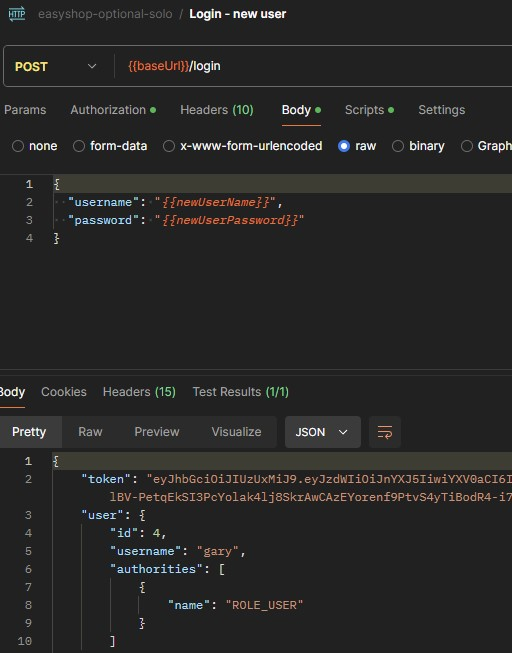

# Easy-Shop Application

## What is easy shop? 
It is an application/ online store named easy shop. I assisted with the project by fixing bugs and adding new features. The website uses consist of Sring Boot API and a MySQL database for storage. The purpose of this project was to have a functioning website that allows the user to login in and register, browse categories and filter through options. We mainly worked on fixing the API's.

## Application Screens
>The First two images are the categories controller and the sql categoriesDao. Those two classes are ones I heavily worked on to get part of the website displaying correctly. 


> Many of my other API's had very similar structure and made sure they were all following the CRUD operations. 

## Testing 

I did my testing mostly through Postman and would occasionally check the website to make sure it was implementing there as well. 


> below are the test for the optional profile feature




## Interest Piece
> the piece of code that really am interested was my profile controller. The reason behind that is beacuse it was the code that made evrything click together for me. It made me understand exactly what i am doing and why I'm doing it. There's still areas in it that I need to learn more about but I got the basics to understand it now. 
```java

@RestController
@RequestMapping("profile")
@CrossOrigin
@PreAuthorize("isAuthenticated()")
public class ProfileController {
    private ProfileDao profileDao;
    private UserDao userDao;

    @Autowired
    public ProfileController(ProfileDao profileDao, UserDao userDao) {
        this.profileDao = profileDao;
        this.userDao=userDao;
    }

    @GetMapping("")
    public Profile getProfile(Principal principal) {
        try {
            String userName = principal.getName();
            User user = userDao.getByUserName(userName);
            int userId = user.getId();
            return profileDao.getUserById(userId);

        }
        catch (Exception e) {
            throw new ResponseStatusException(HttpStatus.INTERNAL_SERVER_ERROR, "Unable to get profile", e);

        }
    }

    @PutMapping("")
    public void updateProfile(Principal principal, @RequestBody Profile profile) {
        try {
            String userName = principal.getName();
            User user = userDao.getByUserName(userName);
            int userId = user.getId();

            profile.setUserId(userId);
            profileDao.update(profile);

        }
        catch (Exception e) {
            throw new ResponseStatusException(HttpStatus.INTERNAL_SERVER_ERROR, "Unable to update profile", e);
        }
    }

}
```


